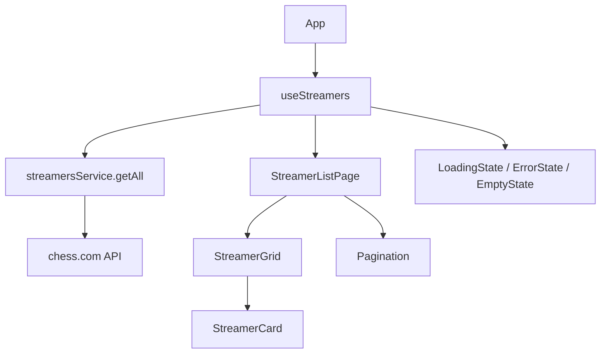

# PRD — Streamers Chess

> Documento de requisitos do produto derivado de [brain_dump.md](./brain_dump.md).  
> Foco: arquitetura limpa, componentização e código sustentável.

---

## 1. Visão geral

**Streamers Chess** é uma aplicação web que lista streamers de xadrez do [chess.com](https://www.chess.com) que estão (ou não) em live. O usuário vê cards com avatar, nome, links e um indicador visual de status online/offline, com paginação quando a lista exceder a tela.

| Item | Definição |
|------|-----------|
| Stack | React 19 + Vite 8 + TypeScript |
| Estado | `useState` + `useEffect` (sem libs externas de estado na v1) |
| API | `GET https://api.chess.com/pub/streamers` |
| Fonte | Inter (Google Fonts) |
| Tema | Fundo cinza escuro, layout minimalista |

---

## 2. Objetivos

### Objetivos de produto
- Exibir todos os streamers retornados pela API em formato de cards legíveis.
- Destacar visualmente quem está em live.
- Permitir navegação entre páginas quando houver muitos streamers.
- Oferecer links para o perfil no chess.com e para a plataforma de streaming.

### Objetivos técnicos
- Separar responsabilidades em camadas (dados, domínio, UI).
- Componentes pequenos, reutilizáveis e testáveis isoladamente.
- Tipagem forte da resposta da API.
- Estilos centralizados em design tokens (CSS variables).
- Facilitar evoluções futuras (filtros, busca, refresh automático) sem refatoração massiva.

---

## 3. Escopo

### In scope (v1)
- Fetch da API de streamers no mount da aplicação.
- Grid responsivo de cards (3–4 colunas em desktop).
- Paginação client-side.
- Estados de loading, erro e lista vazia.
- Card offline com aparência acinzentada/desaturada.
- Indicador visual de live (badge ou ponto pulsante).
- Header com título "Streamers-chess".

### Out of scope (v1)
- Autenticação.
- Backend próprio ou proxy.
- Filtros por plataforma, busca por nome ou ordenação customizada.
- Refresh automático / polling.
- Testes automatizados (recomendados na v2).
- Internacionalização (i18n).

---

## 4. Requisitos funcionais

### RF-01 — Carregar streamers
- Ao montar a página, buscar `https://api.chess.com/pub/streamers`.
- Exibir loading enquanto a requisição estiver em andamento.
- Em caso de falha, exibir mensagem amigável com opção de tentar novamente.

### RF-02 — Exibir informações do streamer
Cada card deve mostrar:

| Campo API | Uso na UI |
|-----------|-----------|
| `username` | Título do card |
| `avatar` | Imagem à esquerda |
| `twitch_url` | Link para streaming (label genérico: "Assistir live" — nome do campo não muda mesmo se for outro provedor) |
| `url` | Link para perfil no chess.com |
| `is_live` | Badge/indicador "AO VIVO" quando `true` |

Campos opcionais para v2: `is_community_streamer`, `platforms`.

### RF-03 — Estado offline
- Quando `is_live === false`, o card inteiro deve parecer offline: tons de cinza, menor contraste, sem animação de live.
- Links continuam clicáveis.

### RF-04 — Paginação
- Itens por página configurável (padrão: 12 — múltiplo de 3 e 4).
- Controles: anterior, próximo, indicador "Página X de Y".
- Paginação só aparece se `total > itemsPerPage`.

### RF-05 — Layout responsivo
- Desktop (≥1024px): 4 colunas.
- Tablet (768–1023px): 3 colunas.
- Mobile (<768px): 1 coluna.
- Conteúdo centralizado em container com largura máxima (~1200px).

---

## 5. Requisitos não funcionais

| ID | Requisito |
|----|-----------|
| RNF-01 | First Contentful Paint aceitável em conexão 3G (sem bloqueio desnecessário). |
| RNF-02 | Componentes puros onde possível; efeitos colaterais apenas em hooks/camada de dados. |
| RNF-03 | Sem `any` em TypeScript; tipos espelham o contrato da API. |
| RNF-04 | Acessibilidade básica: `alt` em avatares, contraste legível, foco visível em links/botões. |
| RNF-05 | Código ESLint-clean (`npm run lint`). |

---

## 6. Contrato da API

### Endpoint
```
GET https://api.chess.com/pub/streamers
```

### Resposta (exemplo)
```json
{
  "streamers": [
    {
      "username": "Blitzstream",
      "avatar": "https://images.chesscomfiles.com/...",
      "twitch_url": "https://twitch.tv/blitzstream",
      "url": "https://www.chess.com/member/Blitzstream",
      "is_live": true,
      "is_community_streamer": false,
      "platforms": [
        {
          "type": "twitch",
          "stream_url": "https://twitch.tv/blitzstream",
          "channel_url": "https://twitch.tv/blitzstream",
          "is_live": true,
          "is_main_live_platform": true
        }
      ]
    }
  ]
}
```

### Observações
- A API é pública e não exige autenticação.
- Possível limitação de CORS no browser; se ocorrer, documentar necessidade de proxy no `vite.config.ts` para desenvolvimento/produção.
- `twitch_url` pode apontar para outro provedor; tratar como URL genérica de stream.

---

## 7. Arquitetura

### 7.1 Princípios

Seguir **Clean Architecture simplificada** para SPA React:

```
┌─────────────────────────────────────────┐
│              Presentation               │  Componentes, páginas, hooks de UI
├─────────────────────────────────────────┤
│              Application                │  Hooks que orquestram estado (useStreamers)
├─────────────────────────────────────────┤
│                Domain                   │  Tipos, constantes, funções puras
├─────────────────────────────────────────┤
│            Infrastructure               │  HTTP client, fetch da API
└─────────────────────────────────────────┘
```

**Regra de dependência:** camadas externas dependem das internas, nunca o contrário. Componentes não chamam `fetch` diretamente.

### 7.2 Fluxo de dados



1. `useStreamers` dispara fetch no `useEffect`.
2. `streamersService` retorna dados tipados ou lança erro.
3. Hook expõe `{ streamers, isLoading, error, refetch }`.
4. Página repassa dados aos componentes de apresentação.
5. Paginação é estado local na página ou hook dedicado `usePagination`.

---

## 8. Estrutura de pastas

```
src/
├── app/
│   └── App.tsx                 # Composição raiz mínima
├── pages/
│   └── StreamerListPage/
│       ├── StreamerListPage.tsx
│       └── StreamerListPage.css
├── components/
│   ├── layout/
│   │   ├── Header/
│   │   │   ├── Header.tsx
│   │   │   └── Header.css
│   │   └── Container/
│   │       ├── Container.tsx
│   │       └── Container.css
│   ├── streamers/
│   │   ├── StreamerCard/
│   │   │   ├── StreamerCard.tsx
│   │   │   └── StreamerCard.css
│   │   ├── StreamerGrid/
│   │   │   ├── StreamerGrid.tsx
│   │   │   └── StreamerGrid.css
│   │   └── LiveBadge/
│   │       ├── LiveBadge.tsx
│   │       └── LiveBadge.css
│   ├── feedback/
│   │   ├── LoadingSpinner/
│   │   ├── ErrorMessage/
│   │   └── EmptyState/
│   └── ui/
│       └── Pagination/
│           ├── Pagination.tsx
│           └── Pagination.css
├── hooks/
│   ├── useStreamers.ts
│   └── usePagination.ts
├── services/
│   └── streamersService.ts
├── types/
│   └── streamer.ts
├── utils/
│   └── pagination.ts           # sliceItems, totalPages (funções puras)
├── styles/
│   ├── tokens.css              # variáveis de cor, espaçamento, tipografia
│   └── global.css              # reset, body, #root
├── main.tsx
└── index.css                   # importa styles/global + tokens
```

> Cada componente em pasta própria com co-localização de CSS. Evitar `App.css` monolítico do template Vite.

---

## 9. Componentização

### 9.1 Árvore de componentes

```
App
└── StreamerListPage
    ├── Header
    ├── Container
    │   ├── LoadingSpinner      (se isLoading)
    │   ├── ErrorMessage        (se error)
    │   ├── EmptyState          (se streamers.length === 0)
    │   └── [conteúdo principal]
    │       ├── StreamerGrid
    │       │   └── StreamerCard (×N)
    │       │       └── LiveBadge (condicional)
    │       └── Pagination
```

### 9.2 Responsabilidades

| Componente | Responsabilidade | Props principais |
|------------|------------------|------------------|
| `Header` | Título centralizado | — |
| `Container` | Largura máxima e padding | `children` |
| `StreamerCard` | Um streamer; layout imagem + info | `streamer: Streamer` |
| `StreamerGrid` | Grid CSS; mapeia lista | `streamers: Streamer[]` |
| `LiveBadge` | Indicador "AO VIVO" | — |
| `Pagination` | Navegação entre páginas | `page`, `totalPages`, `onPageChange` |
| `LoadingSpinner` | Feedback de carregamento | — |
| `ErrorMessage` | Erro + botão retry | `message`, `onRetry` |
| `EmptyState` | Nenhum streamer | — |

### 9.3 Regras de componentes

1. **Presenter vs Container:** lógica de fetch fica em hooks; componentes recebem props.
2. **StreamerCard é puro:** recebe `streamer`, aplica classe `offline` via `!streamer.is_live`.
3. **Sem prop drilling excessivo:** no máximo 2 níveis; se crescer, considerar Context (v2).
4. **Keys estáveis:** `key={streamer.username}` no map.
5. **Links externos:** `target="_blank"` + `rel="noopener noreferrer"`.

---

## 10. Camada de domínio

### `types/streamer.ts`

```typescript
export interface StreamerPlatform {
  type: string
  stream_url: string
  channel_url: string
  is_live: boolean
  is_main_live_platform: boolean
}

export interface Streamer {
  username: string
  avatar: string
  twitch_url: string
  url: string
  is_live: boolean
  is_community_streamer?: boolean
  platforms?: StreamerPlatform[]
}

export interface StreamersResponse {
  streamers: Streamer[]
}
```

### `utils/pagination.ts`

Funções puras, sem React:

```typescript
export function getTotalPages(totalItems: number, itemsPerPage: number): number
export function getPageSlice<T>(items: T[], page: number, itemsPerPage: number): T[]
```

### Constantes

```typescript
// config/constants.ts
export const ITEMS_PER_PAGE = 12
export const STREAMERS_API_URL = 'https://api.chess.com/pub/streamers'
```

---

## 11. Camada de infraestrutura

### `services/streamersService.ts`

```typescript
import type { StreamersResponse } from '../types/streamer'
import { STREAMERS_API_URL } from '../config/constants'

export async function fetchStreamers(): Promise<StreamersResponse> {
  const response = await fetch(STREAMERS_API_URL)

  if (!response.ok) {
    throw new Error(`Falha ao carregar streamers (${response.status})`)
  }

  return response.json() as Promise<StreamersResponse>
}
```

- Único ponto de contato com a API.
- Erros propagados para o hook tratar.
- Futuro: trocar `fetch` por axios, adicionar cache ou retry aqui, sem alterar UI.

---

## 12. Hooks

### `useStreamers`

```typescript
interface UseStreamersReturn {
  streamers: Streamer[]
  isLoading: boolean
  error: string | null
  refetch: () => void
}
```

- `useEffect` chama `fetchStreamers` no mount.
- `refetch` reutiliza a mesma lógica (útil no botão de retry).
- Cancelamento opcional com `AbortController` no cleanup do effect.

### `usePagination`

```typescript
interface UsePaginationReturn<T> {
  page: number
  totalPages: number
  paginatedItems: T[]
  setPage: (page: number) => void
  nextPage: () => void
  prevPage: () => void
}
```

- Recebe `items` e `itemsPerPage`.
- Resetar `page` para 1 quando `items` mudar (novo fetch).

---

## 13. Design system (UI)

### 13.1 Paleta (tokens)

| Token | Valor sugerido | Uso |
|-------|----------------|-----|
| `--color-bg` | `#1a1a1e` | Fundo da página |
| `--color-surface` | `#2a2a30` | Fundo do card (live) |
| `--color-surface-offline` | `#252528` | Card offline |
| `--color-text` | `#e4e4e7` | Texto principal |
| `--color-text-muted` | `#71717a` | Texto secundário / offline |
| `--color-live` | `#ef4444` | Badge ao vivo |
| `--color-border` | `#3f3f46` | Bordas sutis |
| `--radius-card` | `12px` | Cantos arredondados |
| `--font-family` | `'Inter', sans-serif` | Tipografia global |

### 13.2 Tipografia

- Importar Inter no `index.html` ou via `@import` no CSS.
- Header: `font-size: 2.5rem`, `font-weight: 600`, centralizado.
- Username no card: `1.125rem`, `font-weight: 500`.

### 13.3 Card — layout

```
┌──────────────────────────────────────┐
│  [avatar]   username        [LIVE]   │
│             Link chess.com           │
│             Assistir live            │
└──────────────────────────────────────┘
```

- Flex row: avatar fixo (~56px), conteúdo em coluna à direita.
- Card offline: `filter: grayscale(1)`, opacidade reduzida, sem badge live.

### 13.4 Grid

```css
.streamer-grid {
  display: grid;
  gap: 1.25rem;
  grid-template-columns: repeat(4, 1fr);
}

@media (max-width: 1023px) {
  .streamer-grid { grid-template-columns: repeat(3, 1fr); }
}

@media (max-width: 767px) {
  .streamer-grid { grid-template-columns: 1fr; }
}
```

> Alternativa: Tailwind CSS (`grid-cols-4`, `md:grid-cols-3`, etc.). Para v1, CSS puro com tokens mantém o bundle menor e alinha com o projeto atual (sem Tailwind instalado).

### 13.5 LiveBadge

- Ponto vermelho pulsante + texto "AO VIVO".
- Animação CSS `@keyframes pulse` apenas quando live.

---

## 14. Página principal — composição

`StreamerListPage` orquestra:

```typescript
const { streamers, isLoading, error, refetch } = useStreamers()
const { paginatedItems, page, totalPages, setPage, prevPage, nextPage } =
  usePagination(streamers, ITEMS_PER_PAGE)
```

Renderização condicional em ordem:
1. Loading
2. Error (+ retry)
3. Empty
4. Grid + Pagination

---

## 15. Tratamento de erros e edge cases

| Cenário | Comportamento |
|---------|---------------|
| API offline / 5xx | `ErrorMessage` com retry |
| Resposta sem `streamers` | Tratar como array vazio |
| `streamers: []` | `EmptyState` |
| Avatar quebrado | `onError` → placeholder com iniciais ou ícone |
| URL inválida | Links ainda renderizados; validação opcional v2 |
| CORS bloqueado | Proxy no Vite (`server.proxy`) documentado no README |

---

## 16. Plano de implementação

### Fase 1 — Fundação
- [ ] Criar estrutura de pastas conforme seção 8.
- [ ] Definir tipos (`types/streamer.ts`) e constantes.
- [ ] Configurar design tokens e fonte Inter.
- [ ] Implementar `streamersService` + `useStreamers`.

### Fase 2 — UI core
- [ ] `Header`, `Container`, estados de feedback.
- [ ] `StreamerCard` (live + offline).
- [ ] `StreamerGrid` com map.
- [ ] `LiveBadge`.

### Fase 3 — Paginação e polish
- [ ] `usePagination` + `Pagination`.
- [ ] Integrar em `StreamerListPage`.
- [ ] Ajustes responsivos e acessibilidade.
- [ ] Remover template boilerplate do Vite (`App.tsx` atual).

### Fase 4 — Validação
- [ ] `npm run build` sem erros TypeScript.
- [ ] `npm run lint` limpo.
- [ ] Teste manual: loading, erro (devtools offline), lista cheia, paginação, cards offline.

---

## 17. Critérios de aceite

- [ ] Ao abrir o app, streamers da API são exibidos em grid.
- [ ] Streamers com `is_live: true` mostram indicador visual de live.
- [ ] Streamers offline aparecem acinzentados.
- [ ] Cada card exibe avatar, username, link chess.com e link de stream.
- [ ] Com mais de 12 streamers, paginação funciona corretamente.
- [ ] Layout responsivo em mobile, tablet e desktop.
- [ ] Fundo cinza escuro e fonte Inter aplicados globalmente.
- [ ] Código organizado em camadas sem `fetch` dentro de componentes de UI.
- [ ] Header "Streamers-chess" centralizado e minimalista.

---

## 18. Evoluções futuras (backlog)

| Prioridade | Feature |
|------------|---------|
| Média | Filtro "somente ao vivo" |
| Média | Busca por username |
| Média | Auto-refresh a cada N minutos |
| Baixa | Exibir ícone da plataforma via `platforms[].type` |
| Baixa | Testes unitários (`pagination`, `streamersService`) e E2E |
| Baixa | PWA / favicon customizado |

---

## 19. Referências

- [brain_dump.md](./brain_dump.md) — requisitos originais
- [Chess.com Streamers API](https://api.chess.com/pub/streamers)
- [Google Fonts — Inter](https://fonts.google.com/specimen/Inter)
